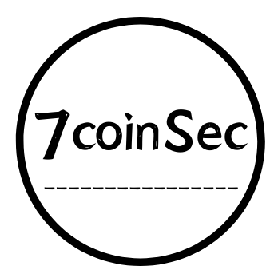

<h1 align="center">ThinkPhp6LangRceTools</h1>

<br>

<div align="center">

</div>


<h3 align="center">一个用于自检Thinkphp多语言漏洞的工具</h3>

<hr>
	<br>
<div align="center">
		
</div>
<h2 align="center">该工具由7coin安全团队强力驱动</h2>
<hr>
	<br>
	<br>

## 免责任声明

该工具仅供学习和参考。因用于其他用途而产生不良后果,作者不承担任何法律责任。

本工具仅能在取得足够合法授权的企业安全建设中使用，在使用本工具过程中，您应确保自己所有行为符合当地的法律法规。 如您在使用本工具的过程中存在任何非法行为，您将自行承担所有后果，本工具所有开发者和所有贡献者不承担任何法律及连带责任。 除非您已充分阅读、完全理解并接受本协议所有条款，否则，请您不要安装并使用本工具。 您的使用行为或者您以其他任何明示或者默示方式表示接受本协议的，即视为您已阅读并同意本协议的约束。


## ThinkPhp6LangRce

一个用于自检Thinkphp多语言漏洞并且可以一键rce的工具，日后再做相关完善。

**注意**

- 本项目仅用于学习交流，请勿用于非法用途
- 如用于非法用法，产生的后果与本项目无关


## Usage:

```py
Usage: "usage:python tp6.py -u/--url -f/--file ","version = 1.0.1"

Options:
  -h, --help            show this help message and exit
  -u URL, --url=URL     Enter the url to be detected
  -f FILEPATH, --file=FILEPATH
                        Enter a list of urls to detect
  -c CHOOSE, --choose=CHOOSE
                        Choose poc detection or exp detection
  -r REMOTEURL, --remoteurl=REMOTEURL
                        enter a remote link
  -v V                  software version

```


## 漏洞复现

docker pull 7coinsec/thinkphp6013_lang_on

docker run -it -d -p 12345:80 7coinsec/thinkphp6013_lang_on


## Example:

漏洞自检测:

单个poc检测：`python3 tp6.py -u "http://example.com" -c poc`

批量poc检测：`python3 tp6.py -f url.txt -c poc`

Getshell: 注:选择 -r/--remote参数，可以从远程下载木马，这在默认getshell失败时可以尝试

单个getshell：`python3 tp6.py -u "http://example.com" -c exp`

批量getshell：`python3 tp6.py -f url.txt -c exp `


## 关注我们

